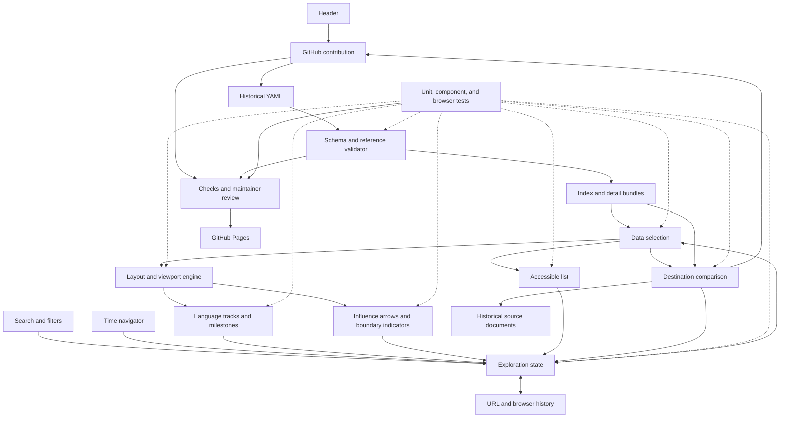

# Architecture and engineering roadmap

The visualization uses years horizontally and language rows vertically. A shared
exploration state keeps filters, URL, timeline, list, and comparison synchronized.

## Boundaries

- Data modules validate records and derive indexes; no UI imports.
- Exploration and layout functions are pure and independently tested.
- Components render derived state and emit actions rather than owning divergent
  copies of selection or filtering.
- Detail bundles load on demand. Visible-row rendering and milestone clustering
  bound DOM size. The accessible list provides equivalent actions.

## Implementation order

1. App, design tokens, test tooling, licenses, and contributor documentation.
2. Validated historical data and build pipeline with a sourced sample.
3. Shared exploration state, filtering, search, and URL encoding.
4. Timeline geometry, tracks, milestones, and range navigation.
5. Influence arrows and destination comparisons.
6. Keyboard, accessible list, mobile details, and browser history.
7. Large-catalog verification and expansion to 30 languages.
8. Release checks, Pages deployment, and scheduled citation-link reports.

Each change includes appropriate tests and a readable atomic commit. Use Vitest
for pure logic, React Testing Library for component behavior, and Playwright for
actual browser geometry and user journeys. Verify 1,000 languages and 10,000
relationships without rendering the full catalog at once.
